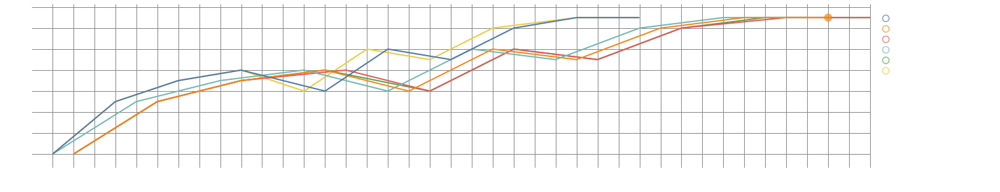

# AWS SageMaker and TensorFlow Tyre Condition Classifier

## Introduction

This repository provides a solution for classifying the condition of tires using AWS SageMaker and TensorFlow. The goal is to build a machine learning model that can predict whether a tire is in good or defective condition based on image data.

## Table of Contents

- [Prerequisites](#prerequisites)
- [Dataset](#dataset)
- [Inference](#inference)
- [Training Model](#training-model)
- [Model Evaluation](#model-evaluation)
- [Deploying the Model](#deploying-the-model)
- [References](#references)

## Prerequisites

Before getting started, ensure you have the following prerequisites in place:

- [AWS Account](https://aws.amazon.com/)
- [AWS SageMaker](https://aws.amazon.com/sagemaker/)
- [Python](https://www.python.org/) (3.7 or later)
- [TensorFlow](https://www.tensorflow.org/) (2.x)
- [AWS Command Line Interface (CLI)](https://aws.amazon.com/cli/)

## Dataset

The tire condition dataset consists of images of tires in various conditions: good, fair, and poor. You can obtain this dataset from [Kaggle](https://www.kaggle.com/datasets/warcoder/tyre-quality-classification). The dataset is organized as the same structure used for and AWS image classification dataset.

## Training Model

This model was trained using [Swin Transformer model](https://tfhub.dev/sayakpaul/swin_base_patch4_window7_224/1) pre-trained on ImageNet-21k (14 million images, 21,841 classes) at resolution 224x224, suitable for off-the-shelf classification.

## Model Evaluation

